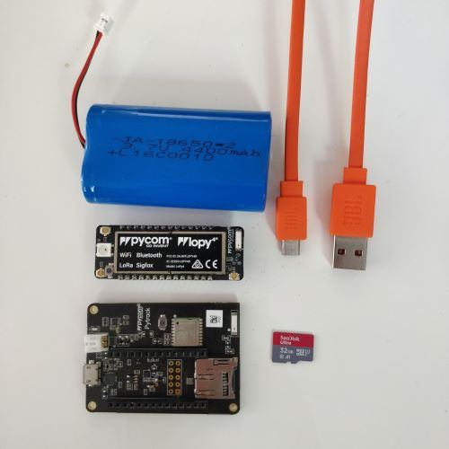

# IoT project tutorial

## Asset tracking with pycom

Samuel Gunnarsson sg223bv

## Project overview

The purpose of this project is to setup a device that can be mounted on any of your belongings and then be able to track them. The device will be able to send GPS coordinates to pybytes over the internet and detect movement. The device also has a micro SD card to be able to store information even if network is unavailable.  

## Time needed

About 2 hours

## Objective

I got the idea after I had a motorcycle stolen a couple of times and I thought it would be nice to get the position of the stolen bike as well as a notification when the bike is being moved. The GPS coordinates that are sent to pybytes will be used to get the latest recorded position of the device and these coordinates can then be pasted into any online map in order to see the posiiton on the map. It is also useful to track movement of the device because it can be used to send alerts when movement is detected and/or wake up the device from sleep. Thefts are very common but I have not heard much about asset tracking even if the technology is since long existent. If a simple device at the right price can help to retrive stolen assets I think it would be used at a greater extent.  

## List of materials



|Part |Specification |Seller |Cost SEK |
|--- | --- | --- | --- |
|[LOPY4](#lopy4) |Development board |[Elektronikservice lopy4](https://www.komponentshoppen.se/?search=283-4985) |377 |
|[Pytrack v1.1](#pytrack) |Expansion board| [Elektronikservice Pytrack](https://www.komponentshoppen.se/?search=2834994) |400 |
|[Lipo battery](#lipo-battery) |3.7V 4400mAh |[Electro kit](https://www.electrokit.com/produkt/batteri-lipo-3-7v-4400mah/) |249 |
|[Micro SD card](#micro-sd-card)|Max 32GB, formatted as fat16 OR fat32 |[Media Markt](https://www.mediamarkt.se/sv/product/_sandisk-minneskort-microsdhc-foto-ultra-32gb-120mb-s-uhs-i-adapt-1330057.html) |89 |
|Micro USB cable |USB 2.0 cable |[Kjell & company](https://www.kjell.com/se/produkter/mobilt/ladda-koppla/kablar-adaptrar/micro-usb-kablar/micro-usb-kabel-1-m-p68687) |100 |

### Lopy4


**Specification**
A Pycom development board with 4 different connection options to choose from. This is the "brain" of the device and also where the code will be uploaded to.  

- Specification sheet can be found here [Lopy4 Specsheet](https://www.farnell.com/datasheets/2571934.pdf)

### Pytrack


**Specification**
This expansion board has everything you need to get started with asset tracking. The built in GPS will be able to get the position of the device and the accelerometer can be used to detect movement and the orientation of the board. The JST connector simplifies attaching batteries to the board. With the MicroSD card slot it has the option to mount a MicroSD card in order to store information which might be useful for example if the internet connection is unavailable.

- Specification Sheet can be found here [Pytrack specsheet](https://www.farnell.com/datasheets/2571938.pdf)

### Lipo Battery


**Specification**
Can be directly connected to the Pytrack expansion board with the JST PH 2.0mm connector and gives power to the device.

**Alternative**
A cheaper alternative for the battery might be to buy a battery holder and insert 3xAAA batteries. It can be found at [electrokit](https://www.electrokit.com/produkt/batterihallare-3xaaa-med-strombrytare-och-jst-kontakt/) and only costs 29sek.

### Micro SD card

**Specification**
The micro SD card will be used to store information from the sensors on the pytrack expansion board. According to [pycom docs](https://docs.pycom.io/firmwareapi/pycom/machine/sd/) the SD card library supports up to 32 GB and it needs to be formatted as either FAT16 or FAT32.

## Computer setup

In order to start developing some additional software and setup is needed. There are some alternatives but I will list those that I have used.

- Pycom firmware update
- Node.js
- Visual studio code
  - Pymakr plugin
- Pybytes account

### Updating Device Firmware

In addition to installing software we also need to update the hardware. In this case it will be both the lopy4 development board and pytrack expansion board. There are already existing tutorials but I will try to add some insights to it.

**Pytrack**
It's best to start with updating the pytrack expansion board.

- Go to: [Updating Expansion board firmware](https://docs.pycom.io/updatefirmware/expansionboard/) and follow those steps.
  - Whenever you see "DFU" download and put them into the same folder
- In addition I would also recommend watching this 15min [Tutorial (How to update firmware)](https://youtu.be/FkycTZvj-ss) where the steps are explained in more detail.  

**Lopy4**
When the expansion board is updated we can update the device. Before updating however we need to connect the lopy4 to the expansion board. Check [Pytting everything together](#putting-everything-together) in this document if you are unsure which way to put it.

- Follow this tutorial: [Updating Devide Firmware](https://docs.pycom.io/updatefirmware/device/)
  - On step 5 choose pybytes.
  - Skip pybytes registration for now

### Install software

**Drivers**
I didn't need to install drivers but in case you do you can find the steps [here](https://docs.pycom.io/gettingstarted/software/drivers/)

**Node.js, VS code and Pymakr**
To get you IDE up and running please follow this tutorial: [VS code](https://docs.pycom.io/gettingstarted/software/vscode/).  

When pymakr is installed open the command palette inside VS code (CTRL + SHIFT + P) and search for "pymakr > global settings" to open a json file. Here change the port address to the port that you are using. If you are unsure of which port the device is connected to open device manager in windows and check your ports.

### Connect to pybytes

Before updating the hardware we want to create an account at pybytes and then add our device there.

- Follow [Getting started with pybytes](https://docs.pycom.io/pybytes/gettingstarted/) steps to create an account and register the device online at pybytes.
  - Choose Wifi as network option
  - Here we will run the firmware updater again and this time add a key to the pybytes registration

### Your first project

Create the basic file structure. It should look like this:

```file structure
project
|  boot.py
|  main.py
|
|__lib
   |  library.py
```

When the code runs it will start checking for a file named [boot.py](none) and run it. Then it looks for a file named [main.py](none). The lib folder will be used to save additional libraries needed for this project.

**[main.py](none)**
Copy this code snippet into the [main.py](none) file

```Python
import pycom
pycom.rgbled(0xFACADE)
```

Check the Pymakr Console which should be visible at the bottom and have the device connected to the computer. It should look like this:


If you can't type in the console try clicking **Pymakr Console** to reconnect.

press **Run** while having the [main.py](none) open in order to run the code once. It will not be saved on the device and if you have libraries in your **lib** foleder which are not uploaded they will not be availible during runtime.

Now try hit **upload** instead and all the code in you **project** folder will be uploaded on the device so the next time it gets a power source the RGB led will still have the new color.

Additionaly you can also write commands manually directly into the Console. Try this to make the RGB led blink blue again.

```python
>>> pycom.heartbeat(True)
```

## Putting everything together

Find the pinout diagrams for the lopy4 and the pytrack to see how they should be connected.

- [Lopy4](https://docs.pycom.io/gitbook/assets/specsheets/Pycom_002_Specsheets_LoPy4_v2.pdf) On page 5.
- [Pytrack](https://docs.pycom.io/gitbook/assets/pytrack-pinout.pdf)

Now just make sure that for Example GND on lopy4 ends up in the GND on the pytrack and you should be good. Make sure all the pins on the lopy4 ends up in a socket and push the devices together. Then the lipo rechargable battery just needs to be plugged in to the JST connection on the pytrack expansion board.

### Result


## Platform

The chosen platform for this project is pybytes which we have already set up in this tutorial. It's well integrated with the pycom devices that are used for this project. You can add a device to pybytes and connect them by providing the device id on pybytes to your pybytes_config.json file in your project that were created when you connected it to pybytes. Now if you go to signals and press "define new signal" pybytes will be able to receive signals that are being sent from your device and display the data.  

## The code

### Get the GPS position from the pytrack

 ```python
import pycom
from L76GNSS import L76GNSS
from pycoproc_1 import Pycoproc
from machine import Timer

py = Pycoproc(Pycoproc.PYTRACK) # Pytrack
l76 = L76GNSS(pytrack=py, timeout=30) # GPS
chrono = Timer.Chrono()
fixTime = 20.00*60.00 # 20 minutes

# Get coordinates
coord = l76.coordinates()
if coord[0] == None or coord[1] == None:
    pycom.rgbled(0xFF7F00) # Yellow
    print("Waiting for GPS... Position: {}".format(coord))
    
    chrono.start()
    while  coord[0] == None or coord[1] == None or chrono.read() > fixTime:
        coord = l76.coordinates()
        time.sleep(5)
    chrono.stop()
    chrono.reset()

if coord[0] == None or coord[1] == None:
    pycom.rgbled(0xFF0000) # Red
    print("No GPS within time limit")
    time.sleep(10)
else:
    pycom.rgbled(0x00FF00) # Green
    print("GPS position established: {}".format(coord))
    time.sleep(1)
 ```

This code handles establishing a GPS fix. It takes some time to get a fix especially from cold start it is around 10 minutes. l76.coordinates() returns the coordinates (latitude, longitude) but if it could not be found it returns (None, None). When entering the first if statement the pycom led turns yellow and then enters a while loop for maximum 20 min trying to get a GPS fix. The next if else statement sets the led to red if coordinates were not found or else green if they were found.

### Writing coordinates to SD card

```python
import os
from machine import SD

# Load SD card
sd = SD()
os.mount(sd, '/sd')

# Write coordinates to SD card
if  not coord[0] == None and not coord[1] == None:
    f = open('/sd/coordinates.txt', 'a') # Append
    f.write("{}".format(coord[1])) # Longitude
    f.write(' ')
    f.write("{}".format(coord[0])) # Latitude
    f.close()
    print("Coordinates written to SD card")
else:
    print("Error no data added to SD card. \nReason: Coordinates {}".format(coord))

```

The SD card needs to be mounted before it can be used and here we load the card and creates a folder named sd on the card. Again we check the coordinates before writing to make sure we were able to get real coordinates otherwise nothing will be written to the card. In f = open() We attempt to open a file called "coordinates.txt" and we are using 'a' = append mode which also creates the file for writing if it didn't already exist. A file pointer will be put at the end of the document so that new coordinates ends up here. Notice that coordinates are here written in the opposite order which since many maps start with the longitude so these coordinates could be pasted directly into for example google maps to check the position on a map. f.close() is important since data written might not be saved if the file is not properly closed.

### Enable wakeup from accelerometer

```python
from LIS2HH12 import LIS2HH12
from pycoproc_1 import Pycoproc

py = Pycoproc(Pycoproc.PYTRACK) # Pytrack
acc = LIS2HH12(py) # Accelerometer

# enable activity and also inactivity interrupts, using the default callback handler
py.setup_int_wake_up(True, True)
print("setup wake up")

# set the acceleration threshold to 2000mG (2G) and the min duration to 200ms
acc.enable_activity_interrupt(2000, 200)
print("enabled activity interrupt")

# go to sleep for 5 minutes maximum if no accelerometer interrupt happens
py.setup_sleep(300) # If run from repl this will crash the repl
py.go_to_sleep(gps=True)
```

As mentioned the pytrack also has an accelerometer which is able to detect movement and orientation of the board. This setup enables the device to wake up from sleep both after a specified time or when the sleep is interupted by movement. If no movement are detected the device will wake up after 5 minutes. When going to sleep "py.go_to_sleep(gps=True)" the GPS is kept on during the sleep in order to quicker be able to establish a location when waking up again.

The code py.setup_int_wake_up(rising=True, falling=True) sets the interrupt to happen both when movement is detected and also when movement is stopping.

With acc.enable_activity_interrupt(2000, 200) you can set the sensitivity of the interrupt. If kept like this it will trigger the interrupt if the board moves with a force of 2 grams for more than 0.2 seconds.

## Transmitting the data / connectivity

The data is sent with approximately 6 minute intervals to pybytes depending on how long it takes for the GPS to get the position. The device is connected to the internet using WiFi. This is done by providing your ssid and password in the pybytes_config.json file. By doing this it connects to the WiFi automatically when the device starts. Then the data is sent to pybytes using Mqtt transport protocol. Because WiFi is used and we need to be connected in order to send data it would not be a good option to track assets outside of your WiFi range. Lora and sigfox had good range but not so much outside of towns so I would not choose it for asset tracking. I would recommend buying for example the pycom device fipy which has a built in socket for SIM cards and then sign up and send data over cellular network. It's pretty cheap to since the GPS coordinates we are sending takes very little data. The coordinates we are sending in this project takes about 24bytes so imagine having a cellular limit of 200mb/ month which still would suffice for roughly about 20 messages per minute.

```python
# Enable pybytes
pybytes_enabled = False
if 'pybytes' in globals():
    if(pybytes.isconnected()):
        print('Pybytes is connected')
        pybytes_enabled = True

# Send to pybytes
if(pybytes_enabled and not coord[0] == None and not coord[1] == None):
    print("Sending to pybytes: {}".format(coord))
    pybytes.send_signal(1, coord)
else:
    print("Skipped sending {} to pybytes".format(coord))
```

The above code checks if pybytes is connected and then sends the data only if valid GPS coordinates were retreived.

## Presenting the data


Now the coordinates are visible at pybytes under signals for the device. In the future I would like to display them directly on a map so you dont have to copy paste the coordinates to an online map. The data sent is saved to pybytes and will be stored for one month before it gets deleted.

## Finalizing the design

Since this project is about asset tracking it still needs some changes before it could be considered completed. However there are some lessons learned throughout this project that are valuable. Regarding the hardware I have realised that a GPS takes some time to get a location fixed which might be a problem. I used the pytrack1 without realising there was a pytrack2. I also saw that the pytrack2 has the possibility to connect an antenna for the GPS which I believe would make the GPS more accurate and maybe quicker to find the location. Also there are more ways to get the position than using the GPS so why not use different sources in order to get the position. Additionally on the hardware part I bought the lopy4 and tested both WiFi, lora and sigfox networks but realised that if I want to be able to get good enough coverage to retreive some stolen item I would go with cellular and hence would need for example a sim card socket on the device. The fipy has one but it's quite expensive so if this project were to be produced in greate quantity I would look for cheaper examples.

As for now the location is only sent to pybytes but in addition I would also like to set up a way of getting notifications when for example when the device is moving, stopped or low on battery etc. And then instead of showing the coordinates on the dashboard it should be presented on a map directly.

Overall I think I've learned a lot even if I didn't get as far as I expected with the project. Still I think it was a good thing to learn while trying out a bunch of different stuff and see what worked well and not so well.


## Troubleshooting

**Stuck in rebooting loop**
Use this dscussion [Here](https://forum.pycom.io/topic/5389/lopy4-stuck-in-rebooting-loop/3). As @catalin replies:

- Open command prompt and navigate to where you have installed the Firmware update tool and execute:

    ```command
    pycom-fwtool-cli -p <PORT> erase_all
    ```  

    replacing \<PORT> with the actual port of the device for example COM4.
    And then you also have to run the "Firmware update tool" again.
